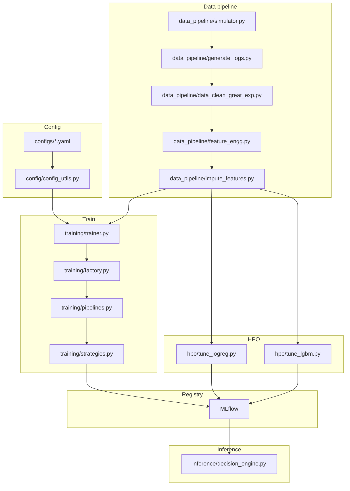

# ML Notification System

Predict the optimal time to send push notifications to maximize user engagement while minimizing notification fatigue.

## Problem

Sending notifications at the wrong time leads to:
- Low open rates
- User fatigue and app uninstalls
- Missed engagement opportunities

This system uses ML (conditional probability estimation) to predict when each user is most likely to engage with a notification.
So, P(open | given_hour, user_features) is the best time to send notification to a given user.

We built a simulator to prepare user behavirour logs for N users based on differnt type (early bird, night owl, regular, sporadic) and added values for fatigue for number of notiifications.
Currently using data from 100 users over a span of 30 days (where 1 notification was sent per day)

Used
- MLFlow Model Registry, Tracking and Serving for experiment steup (Local Self hosting setup)
- Great expectations for data quality checks

## System Architecture



## Setup

```bash
# Create virtual environment
python -m venv ml_notifi_env
source ml_notifi_env/bin/activate  # Linux/Mac
# or: ml_notifi_env\Scripts\activate  # Windows

# Install dependencies
pip install pandas numpy scikit-learn mlflow matplotlib seaborn great_expectations python-dotenv pytest

# Start MLflow server (optional, for experiment tracking)
mlflow server --host 0.0.0.0 --port 5000
```

## Quick Start

```bash
# 1. Generate synthetic data
python -m data_pipeline.simulator
python -m data_pipeline.generate_logs

# 2. Feature engineering + imputation
python -m data_pipeline.feature_engg
python -m data_pipeline.impute_features

# 3. Train model (logs to MLflow)
python -m training.trainer --config configs/logreg.yaml   # Logistic Regression
python -m training.trainer --config configs/lgbm.yaml      # LightGBM
python -m training.trainer --config configs/xgb.yaml       # XGBoost

# 4. Hyperparameter tuning with Optuna
python -m hpo.tune_logreg    # Logistic Regression HPO
python -m hpo.tune_lgbm      # LightGBM HPO

# 5. Run decision engine
python -m inference.decision_engine
```

## Testing

Run unit tests with pytest:

```bash
pytest tests/ -v
```

## Data Versioning with DVC

We use [DVC (Data Version Control)](https://dvc.org/) to track and version large data files alongside Git.

### Initial Setup (one-time)

```bash
# Install DVC
pip install dvc

# Initialize DVC in your repo (already done)
dvc init

# Add remote storage (local folder in this case)
dvc remote add -d myremote data/files
```

### Adding a New Dataset Version

Whenever you update or add new data files:

```bash
# 1. Add the data file to DVC tracking
dvc add data/your_new_file.csv

# 2. Stage the .dvc pointer file and updated .gitignore
git add data/your_new_file.csv.dvc data/.gitignore

# 3. Commit the changes to Git
git commit -m "Add new dataset version: your_new_file.csv"

# 4. Push data to DVC remote storage
dvc push

# 5. Push code changes to Git remote
git push
```

### Pulling Data (for collaborators)

```bash
# After cloning the repo, pull the actual data files
git pull
dvc pull
```

### Switching Between Dataset Versions

```bash
# Checkout a specific Git commit/tag
git checkout <commit-hash>

# Pull the corresponding data version
dvc checkout
```